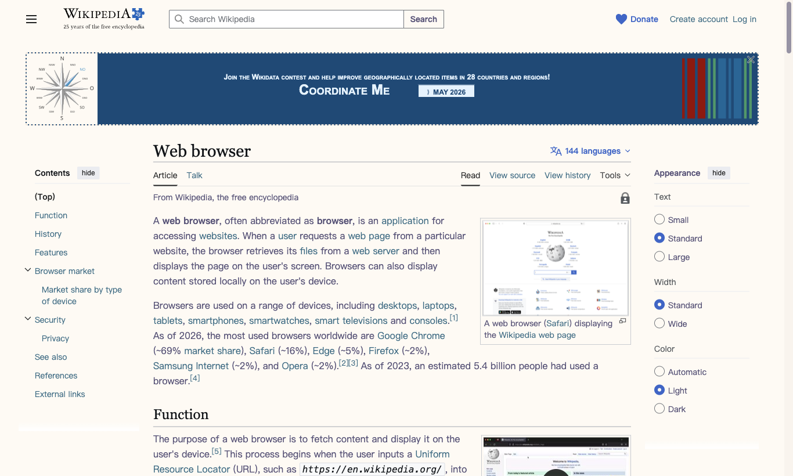
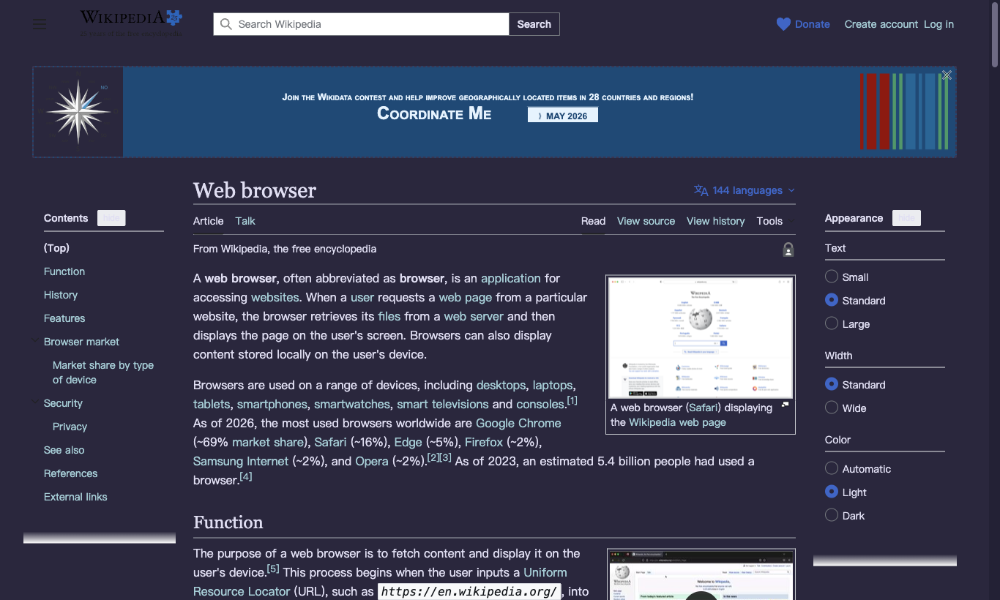
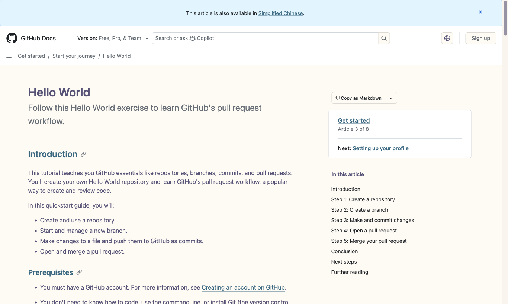
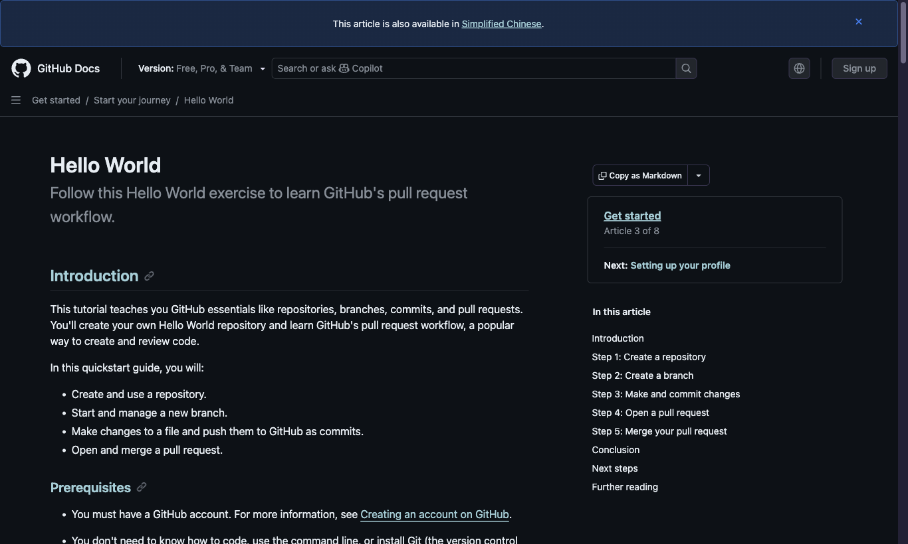
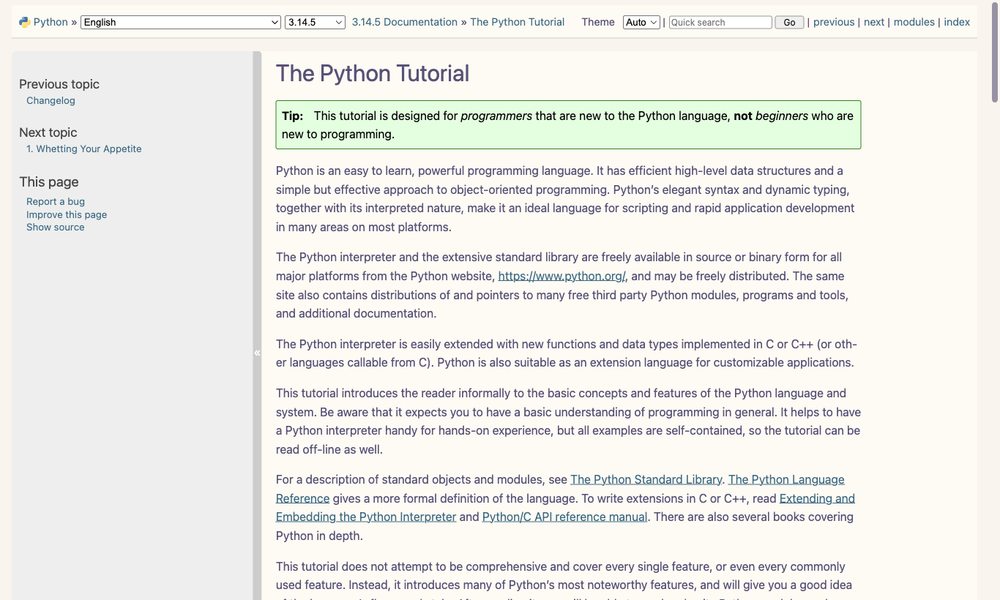
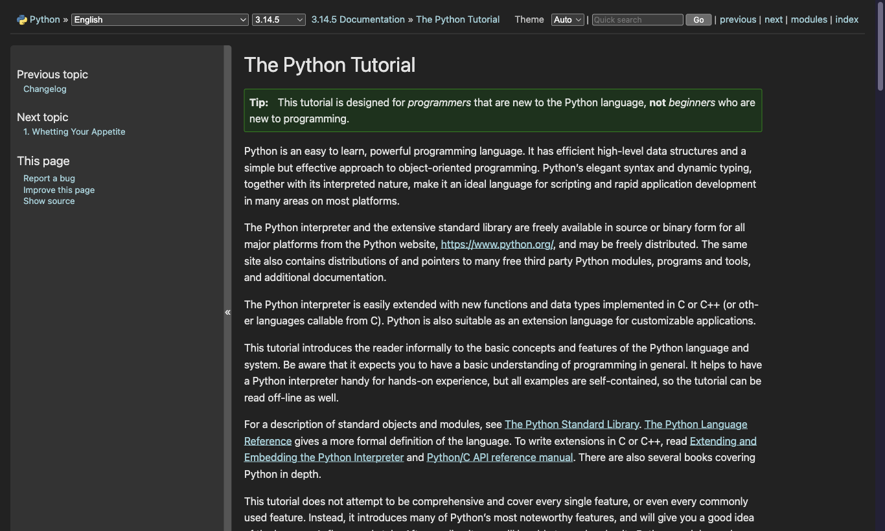
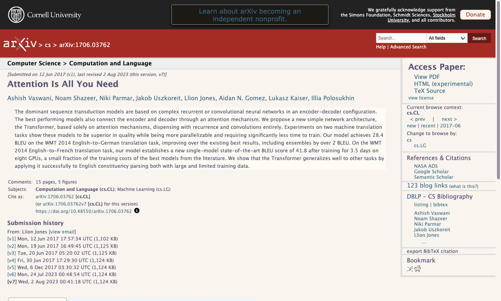
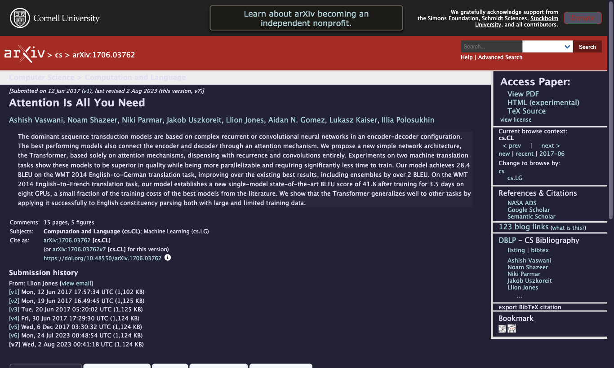

# Rosewash

Rosewash is a lightweight Manifest V3 browser extension that tints harsh white
web pages with restrained, curated color palettes. The current MVP ships with
Rose Pine Dawn and Moon.

The first version is intentionally small: it does not try to become a full
dynamic theme engine. It finds pure-white and near-white backgrounds, replaces
them with warm paper tones, adjusts neutral dark text, and leaves media and code
surfaces alone.

## Features

- Auto / Dawn / Moon mode.
- Global enable switch.
- Per-site block list.
- Near-white background and border tinting, including default transparent
  page canvases used by older sites such as jmlr.org.
- Page-level headers and navigation bars blend into the active page base,
  including colored top bars such as arXiv's and Zhihu `AppHeader` shells
  (forced even when styled via CSS-in-JS).
- Dark-only page detection that adapts dark native sites to Dawn in Auto-light
  or manual Dawn mode.
- CSS Color 4 tone detection for modern `lab()`, `oklab()`, `lch()`, and
  `oklch()` authored pages.
- Moon mode turns dark neutral text into Rose Pine Moon text, even when the
  text sits on a transparent child element.
- Media, canvas, SVG, inputs, editors, and code block protection.
- No runtime dependencies or build step.

## Screenshots

| Site | Dawn | Moon |
| --- | --- | --- |
| [Wikipedia](https://en.wikipedia.org/wiki/Web_browser) |  |  |
| [GitHub Docs](https://docs.github.com/en/get-started/start-your-journey/hello-world) |  |  |
| [Python Docs](https://docs.python.org/3/tutorial/index.html) |  |  |
| [arXiv](https://arxiv.org/abs/1706.03762) |  |  |

## Install From Release

Rosewash is not on the Chrome Web Store. Install from a [GitHub
Release](https://github.com/Yalyenea/rosewash/releases) instead. Works in
Chrome, Edge, Brave, Helium, and other Chromium browsers.

1. Open the [latest release](https://github.com/Yalyenea/rosewash/releases/latest).
2. Download `rosewash-vX.Y.Z.zip` (for example `rosewash-v0.1.0.zip`).
3. Extract the zip to a stable folder you will keep (do not delete it later;
   Chromium loads the extension from that path).
4. Open the extensions page:
   - Chrome / Brave / Helium: `chrome://extensions`
   - Edge: `edge://extensions`
5. Enable **Developer mode**.
6. Click **Load unpacked** and select the **extracted folder** that contains
   `manifest.json` (not the zip itself).

To update later: download the newer release zip, replace the extracted folder
contents, then click **Reload** on the extension card. Reload any already-open
tabs once so pages pick up the new content script.

Chrome may show a developer-mode warning on each browser restart. That is
expected for sideloaded extensions and is safe to dismiss.

## Install From Source

For local development:

1. Clone this repository.
2. Open `chrome://extensions` (or the equivalent page above).
3. Enable **Developer mode**.
4. **Load unpacked** and select this project folder (the one that contains
   `manifest.json`).

After reloading the unpacked extension, reload any already-open test tabs once.
Chrome leaves old content scripts in existing page contexts after extension
reloads; Rosewash guards new scripts against that state and clears stale
Rosewash inline styles when the new script starts, but old injected scripts
cannot be patched in place.

## Dev Loop

```sh
just test
just validate
just check
just package
```

`just package` writes `.tmp/rosewash.zip`.

## Publishing Releases

GitHub Actions publishes a release zip whenever a version tag is pushed:

```sh
git tag v0.1.0
git push origin v0.1.0
```

The workflow runs `just package`, then uploads `rosewash-v0.1.0.zip` to the
matching GitHub Release. It can also be run manually against an existing tag
from the Actions tab.

## Palette

| Token | Dawn | Moon |
| --- | --- | --- |
| Base | `#faf4ed` | `#232136` |
| Surface | `#fffaf3` | `#2a273f` |
| Overlay | `#f2e9de` | `#393552` |
| Muted | `#9893a5` | `#6e6a86` |
| Text | `#575279` | `#e0def4` |

## Scope

Rosewash only changes the parts of a page that are likely to be eye-straining
white surfaces, plus dark-only pages that expose no light appearance for
Auto-light or Dawn users. It samples common document roots and SPA app roots so
Tailwind-style pages can be classified without URL-specific rules. Complex
app-specific theme engines, filter inversion, and site-specific rule packs are
left for later versions. Future versions should add more theme presets through a
shared palette registry instead of site-specific or theme-specific branches.

## License

MIT.
