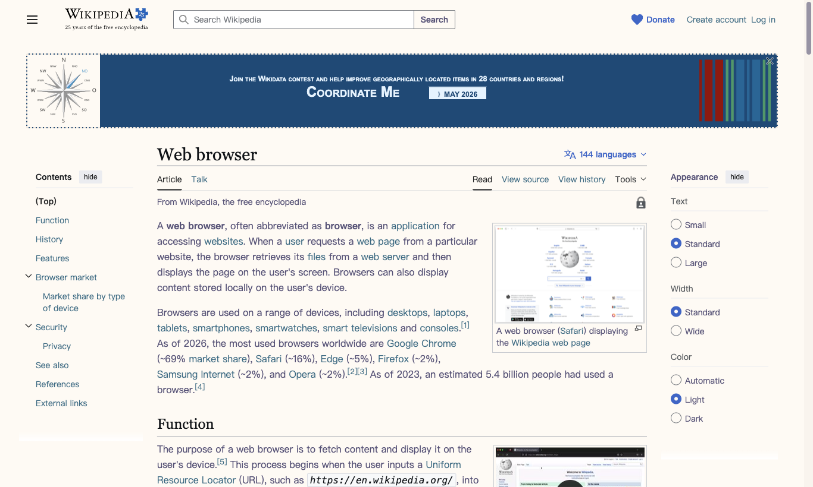
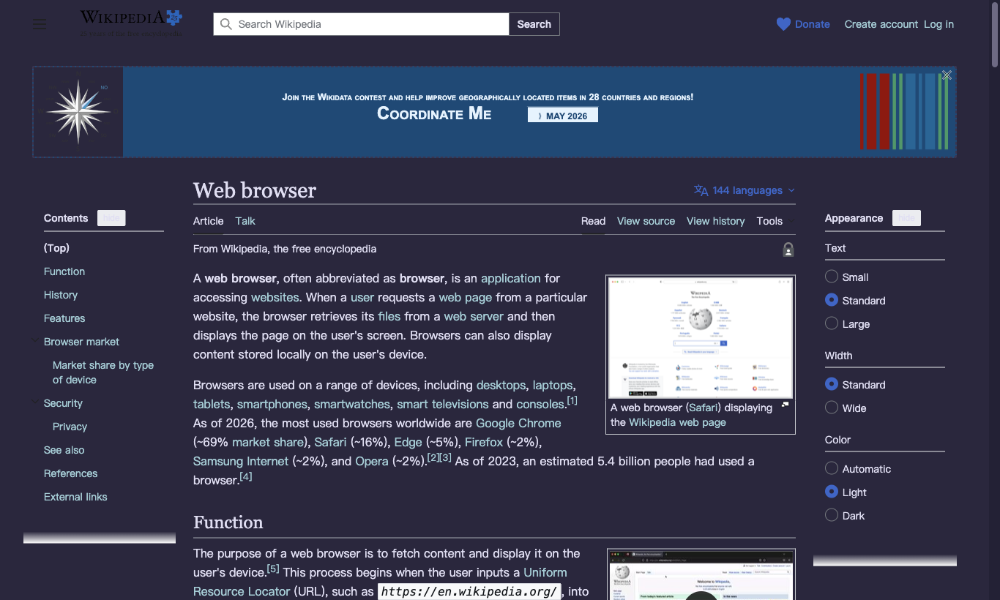
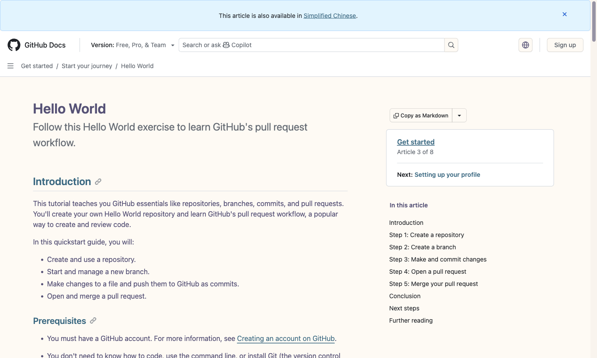
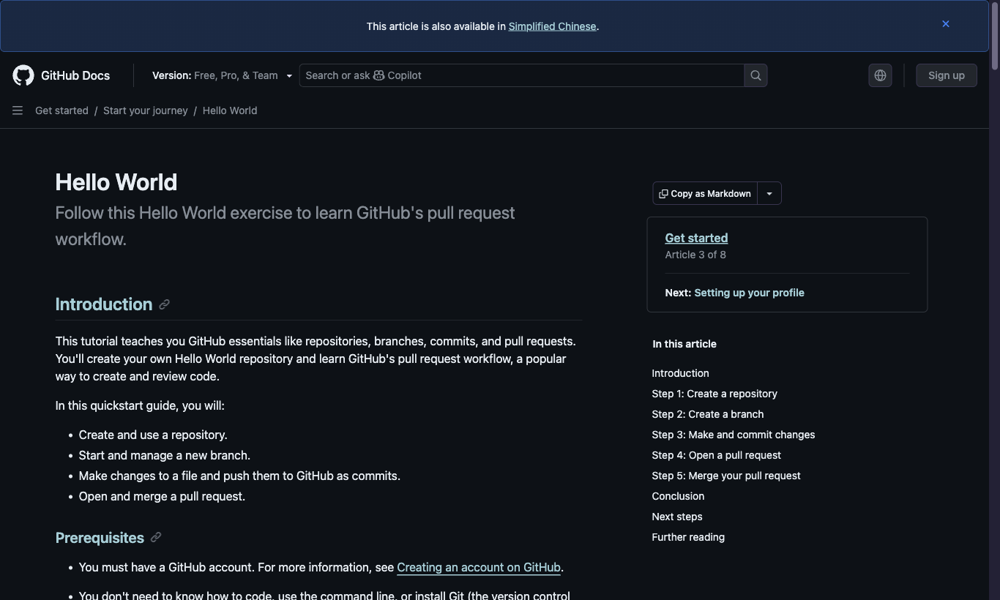
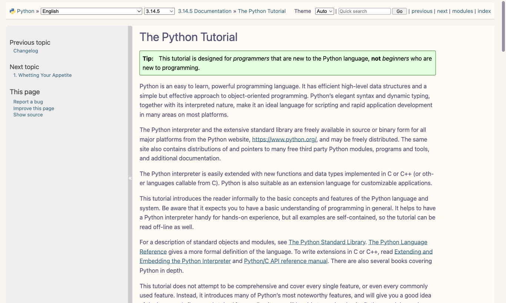
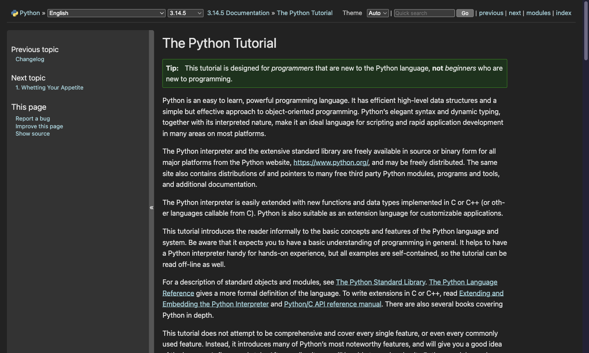
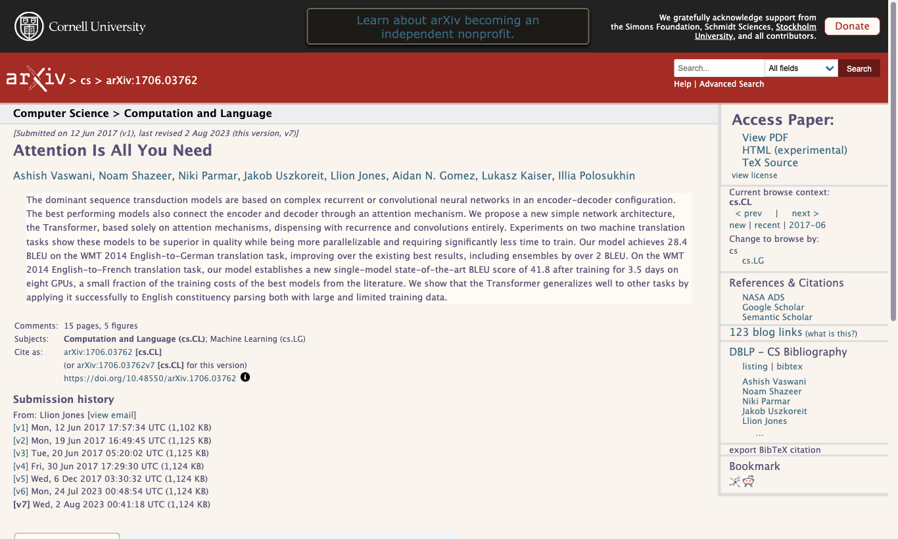
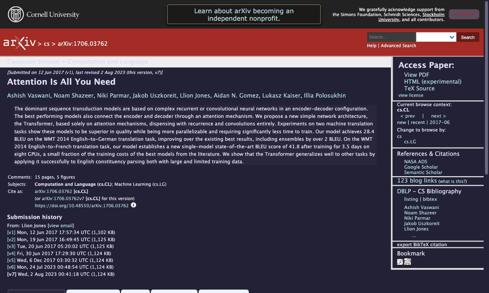

# Rosewash

Rosewash is a lightweight Manifest V3 browser extension that covers web pages
with restrained paper palettes. Rose Pine is the default; the popup also offers
the full set of Codex desktop app theme families (Catppuccin, Gruvbox, Nord,
Tokyo Night, Solarized, Dracula, GitHub, Linear, Notion, Raycast, Vercel, …).

It remaps page canvases, painted surfaces, neutral borders, and text into the
active palette so everyday browsing follows a calm paper tone instead of harsh
site defaults. Media, canvas, SVG, inputs, editors, and code blocks stay
protected.

## Features

- Independent light and dark palette selectors (28 Codex-aligned families;
  default Rose Pine for both).
- Appearance: Auto / Light / Dark. Auto uses the light or dark palette from
  the system color scheme.
- Global enable switch.
- Per-site block list.
- Optional responsive compact layout for X from 720px, with a collapsed
  navigation rail, adjustable centered timelines, rail-based search, and split
  thread views on wide screens.
- Default shortcut `Alt+Shift+B` toggles blocked / allowed for the current site
  (rebind under `chrome://extensions/shortcuts`).
- Full-page paper cover for light, dark, and cool-paper sites.
- Default transparent `html`/`body` canvases (legacy pages such as jmlr.org).
- Page-level headers and navigation bars blend into the active page base,
  including colored top bars such as arXiv's and Zhihu `AppHeader` shells
  (forced even when styled via CSS-in-JS).
- Root CSS custom property remapping for design-token backgrounds and text
  (`--ground`, `--ink`, ChatGPT surface tokens, Substack publication vars, …).
- CSS Color 4 tone parsing for modern `lab()`, `oklab()`, `lch()`, and
  `oklch()` authored pages.
- Media, canvas, SVG, inputs, editors, and code block protection.
- No runtime dependencies or build step.

## Screenshots

| Site | Dawn | Moon |
| --- | --- | --- |
| [Wikipedia](https://en.wikipedia.org/wiki/Web_browser) |  |  |
| [GitHub Docs](https://docs.github.com/en/get-started/start-your-journey/hello-world) |  |  |
| [Python Docs](https://docs.python.org/3/tutorial/index.html) |  |  |
| [arXiv](https://arxiv.org/abs/1706.03762) |  |  |

## Install From Release

Rosewash is not on the Chrome Web Store. Install from a [GitHub
Release](https://github.com/Yalyenea/rosewash/releases) instead. Works in
Chrome, Edge, Brave, Helium, and other Chromium browsers.

1. Open the [latest release](https://github.com/Yalyenea/rosewash/releases/latest).
2. Download `rosewash-vX.Y.Z.zip` (for example `rosewash-v0.2.0.zip`).
3. Extract the zip to a stable folder you will keep (do not delete it later;
   Chromium loads the extension from that path).
4. Open the extensions page:
   - Chrome / Brave / Helium: `chrome://extensions`
   - Edge: `edge://extensions`
5. Enable **Developer mode**.
6. Click **Load unpacked** and select the **extracted folder** that contains
   `manifest.json` (not the zip itself).

To update later: download the newer release zip, replace the extracted folder
contents, then click **Reload** on the extension card. Reload any already-open
tabs once so pages pick up the new content script.

Chrome may show a developer-mode warning on each browser restart. That is
expected for sideloaded extensions and is safe to dismiss.

## Install From Source

For local development:

1. Clone this repository.
2. Run `just dist` to stage a loadable folder.
3. Open `chrome://extensions` (or the equivalent page above).
4. Enable **Developer mode**.
5. **Load unpacked** and select the `dist/` folder (not the repo root).

Re-run `just dist` after source changes, then reload the extension.

After reloading the unpacked extension, reload any already-open test tabs once.
Chrome leaves old content scripts in existing page contexts after extension
reloads; Rosewash guards new scripts against that state and clears stale
Rosewash inline styles when the new script starts, but old injected scripts
cannot be patched in place.

## Docs

- [AGENTS.md](AGENTS.md) — entry point for coding agents
- [docs/implementation.md](docs/implementation.md) — current implementation details
- [docs/architecture.md](docs/architecture.md) — conceptual layers
- [PLAN.md](PLAN.md) — roadmap

## Dev Loop

```sh
just test
just validate
just check
just dist
just package
just clean
```

`just dist` writes `dist/` for Load unpacked. `just package` runs the checks,
refreshes `dist/`, and writes `.tmp/rosewash.zip`. `just clean` removes `.tmp`
and local browser-debug leftovers.

## Publishing Releases

GitHub Actions publishes a release zip whenever a version tag is pushed:

```sh
git tag v0.2.0
git push origin v0.2.0
```

The workflow runs `just package`, then uploads `rosewash-v0.2.0.zip` to the
matching GitHub Release. It can also be run manually against an existing tag
from the Actions tab.

## Palette

| Token | Dawn | Moon |
| --- | --- | --- |
| Base | `#faf4ed` | `#232136` |
| Surface | `#fffaf3` | `#2a273f` |
| Overlay | `#f2e9de` | `#393552` |
| Muted | `#9893a5` | `#6e6a86` |
| Text | `#575279` | `#e0def4` |

## Scope

Rosewash remaps page canvases, painted surfaces, text, and low-chroma borders
into the active Dawn or Moon palette. It samples common document roots and SPA
app roots so modern CSS and design-token pages are covered without URL-specific
rules. Media, canvas, SVG, inputs, editors, and code stay protected. Complex
filter inversion and large site-specific rule packs are left for later versions.
Future versions should add more theme presets through a shared palette registry
instead of site-specific or theme-specific branches.

## License

MIT.
